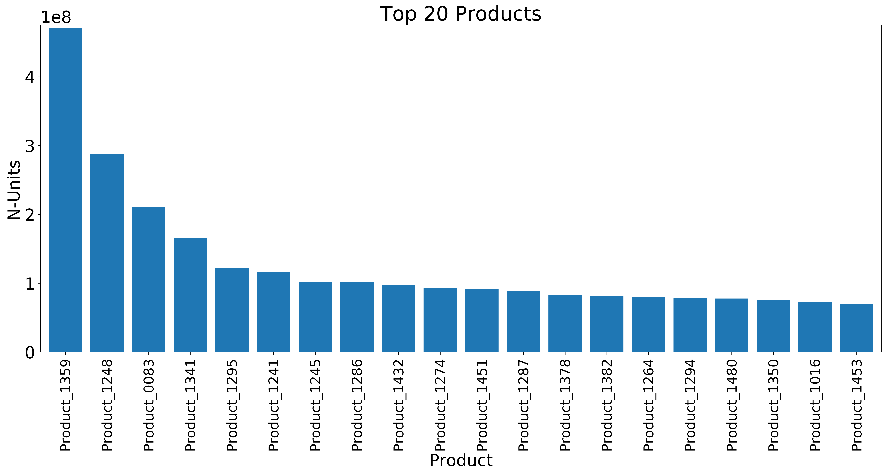
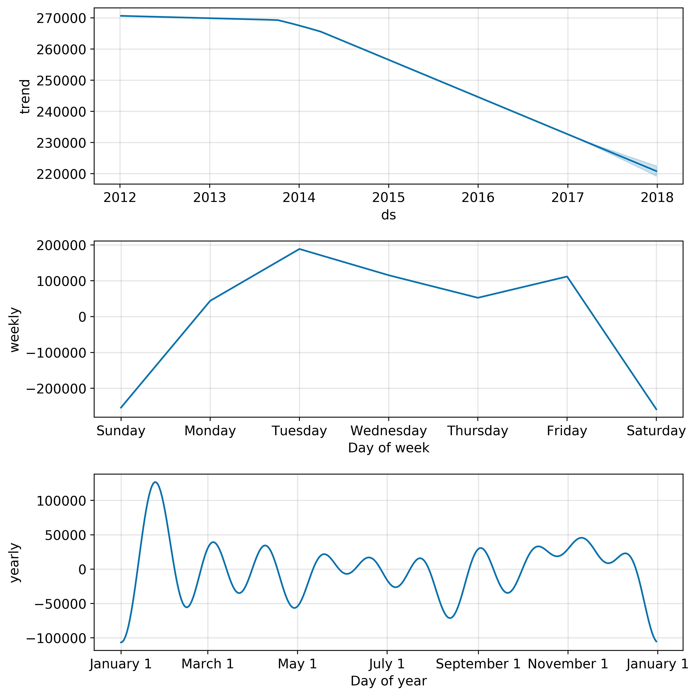
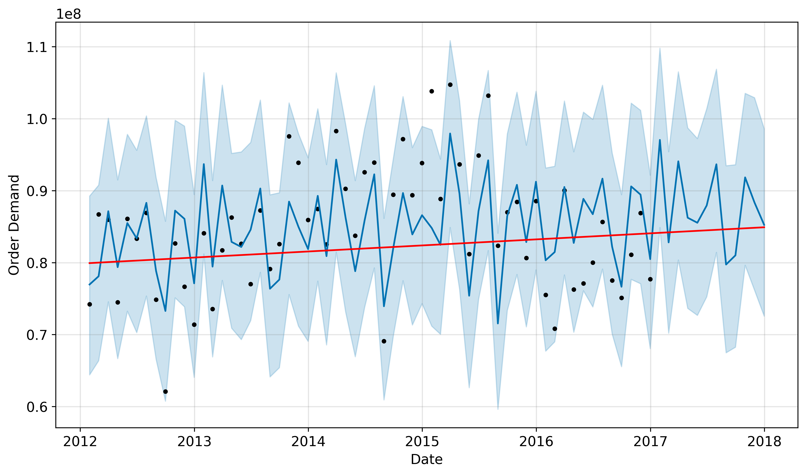

# Product-Demand-Forecasting

## Forecasting product demand using Facebook Prophet's additive linear model algorithm. 

### Author: Jessica Forrest-Baldini

## Business Case

A global manufacturer has four warehouses worldwide. They want to implement a product demand strategy to optimize warehouse inventory and increase turn-over rates.

## Business Value

Warehouses are costly to run. Each square foot of space is valuable. If a product stays on the floor too long, it ends up costing the warehouse more money to store it than profits of its sale would be worth. Conversly, if there is not enough product to meet demand, a shortage can occur, which slows down imperative supply-chains for customers, which decreases customer satisfaction and contributes to the loss of business.

By optimizing between these two, customers remain happy, and valuable floor space is occupied by products with a cost-efficient turn-over rate, saving the manufacturer significantly in profits and customer satisfaction and retention.

## Data

https://www.kaggle.com/felixzhao/productdemandforecasting
Historical Product Demand.csv (48.88 MB)

## Contents 

- Figures - Project Figures
- .gitignore - gitignore file
- Product-Demand-Forecasting.ipynb - Project Notebook
- Product-Demand-Forecasting.pdf - Presentation Slides
- README.md - Readme File

## Methods 

Selected top selling product and fitted Prophet time series model. Built baseline models for 3 frequencies:
- Daily
- Weekly
- Monthly

Selected best-fitting model according to mean absolute percentage error (MAPE). This was monthly forecasting.

From there tuned the hyperparameters change point and seasonality prior scales using gridsearch. Once the optimal values were identified, the model was tuned.

## Results

The final result was a model with 6.47% MAPE, which is great accuracy for product demand forecasting.  
  
### Top EDA Insights

- The top selling product came from Warehouse J exclusively. This warehouse was also the highest producing warehouse in terms of units sold. 

- The top selling product had lower quantities of products per order, which suggests that this product is ordered more frequently than other products. 

- At Warehouse J, the top 100 selling items (out of 2157 products) make up 86.14% of all units sold.

### Component Trends

- There was an overall downward trend of product sales starting with an inflection point in Q3 of 2014. 

- Peak orders occur on Tuesday with a drop-off on the weekends, indicative of a M-F operating schedule. 

- There is a drop-off in orders late December through the new year, followed by a large peak in demand in early February.

## Recommendations

Based on the findings, I recommend:

- Using a monthly model to forcast inventory demand
- Calculate the reorder point using the equation:
    - ROP = (average daily sales x lead time) + safety stock
- Run this process for all of the top products

## Future Work (Also Recommendations)

### Optimize Inventory

In our analysis I discovered that the top 100 products (out of 2157 total) result in 86.54% of total units of products sold.

### Pricing Data

This data set did not include any pricing data. However with pricing data, the cost of goods for each product can be calculated, as well as carrying costs.

### Carrying Costs

A research study showed that holding onto inventory for 12 months could increase the cost of that item by as much as 60%.

Reference: https://www.hollingsworthllc.com/demand-forecasting-how-to-forecast-your-supply-chain

### Cost Analysis

Then a cost analysis can be done to find which products are profitable and which are being held at a loss. In addition to that, the most profitable products can be calculated and a set bottom percentage can be eliminated. This will increase efficiency and profits.

### Negative Demand

Another thing to consider is negative demand, which represents returns. It would be beneficial to analyze products and see which ones have the highest return rates, then asses why (is it something that can be improved?) and if they're profitable to carry.

## Thank you!

For any additional questions, please feel free to connect with me at jlforrestbaldini@gmail.com or on LinkedIn at https://www.linkedin.com/in/jessica-forrest-baldini
